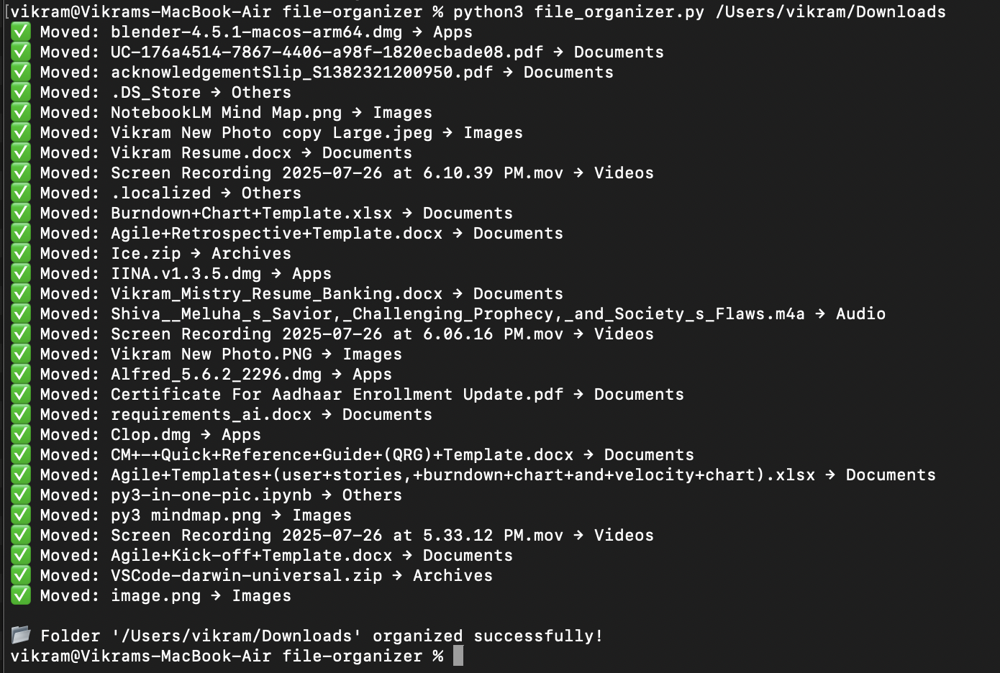

# File Organizer

A Python script to automatically organize files in a specified folder into categorized subfolders based on file types.

## Features

- Automatically moves files into folders like **Documents**, **Images**, **Videos**, **Audio**, **Archives**, **Apps**, and **Others**.
- Supports organizing any folder by providing the path as an argument or via prompt.
- Non-destructive: existing folders and files not matched by categories remain unaffected.
- Easy to use and extend with more file type categories.

## Usage

Run the script with Python 3:

~~~bash
python3 file_organizer.py /path/to/folder
~~~

If no folder path is provided, it defaults to organizing the Downloads folder.

Example:

~~~bash
python3 file_organizer.py /Users/username/Downloads
~~~

## Requirements

- Python 3.x

## How it works

- Scans the target folder.
- Detects file types based on extensions.
- Moves files into corresponding folders.
- Creates folders if they don’t exist.

## Notes

- Running the script multiple times will not affect already organized files.
- The script does not modify files inside existing subfolders.
- Files without known extensions are moved to the **Others** folder.

# Output Text sample:
✅ Moved: example.pdf → Documents
✅ Moved: vacation.jpg → Images
✅ Moved: project.zip → Archives
✅ Moved: app.dmg → Apps

📂 Folder '/Users/username/Downloads' organized successfully!

# Screenshot
